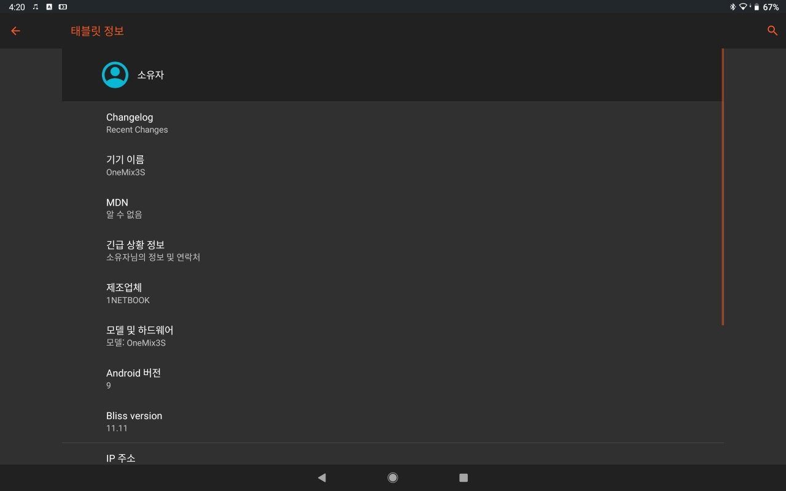
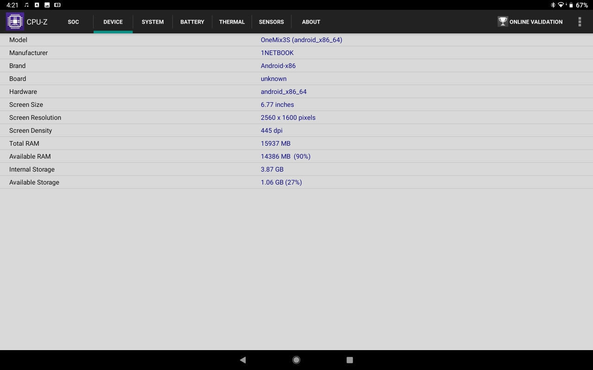
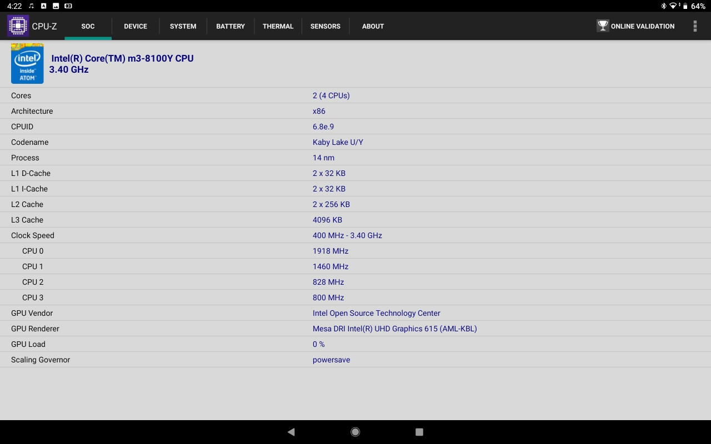

# One-Mix-3S-Android
One-Mix 3 &amp; 3s Full Working on Android9 Pie(BlissOS11.11)  

This project made by south korea then "readme.txt"'s language is korean.

## The Install:

1. Download Link File

   https://sourceforge.net/projects/blissos-x86/files/Official/bleeding_edge/Generic%20builds%20-%20Pie/Bliss-v11.11--OFFICIAL-20200624-2026_x86_64_k-k4.19.122-ax86-ga-rmi_m-p9.0-x86_dgc-p9.0-03.15.20_ld-p9.0-x86_dg-p9.0-x86_dh-p9.0-x86_mg-p9.0-x86.iso/download

   (※ You do not recieve 20200803 becouse not working sleep mode)

2. Settup Download File. You must be set "YES" when choose system read/write.

   - Bliss OS XDA

      https://forum.xda-developers.com/bliss-roms/bliss-roms-development/bliss-os-pie-beta-preview-t3855917

   - Bliss OS Install document

      https://docs.blissroms.com/Bliss%20OS/installation-guide/

   - Bliss OS Install Guide in Youtube

      https://www.youtube.com/watch?v=MmGiCqFvYEQ

3. Download UploadFile and copy USB Drive.

4. connect your USB Drive and running patch script.

   - run "Android Terminal Emulator"

     * su
     * Rooting Request -> You select "Remaember choice foreve", click "Allow"
     * df -h 
     * check your USB Drive mount point.  -> ex) /mnt/media_rw/mountname
     * move mount point
     * cd /mnt/media_rw/mountname/BlissOSV11.11_for_onemix3s (tip : if you make some sentense then "tap key" make auto sentense)
     * sh ./patch.sh
     * exit

5. reboot android system and if you see change boot logo then you success patch.
   
## OS Status:

   - Android Info :

   - CPU Z :

## Working:

   1. Wifi ok 
   2. Sleep Mode ok
      - sleep by timeout (power lamp blue)
      - sleep by power menu (power lamp yellow and blingking)
   3. bluetooth ok 
   4. sound ok 
   5. touch ok 
      - touch by hand ok 
      - touch by pen -> working similar touch pad 
   6. sd card mount at /mnt/sdcard_ext
      - only working by script on boot, not auto mount.
   7. windows internal disk(ntfs) mount
      - only working by script on boot, not auto mount.
      - mount point is your windows drive label name. (ex) if your c drive name is "c_drive" then mount point is /mnt/c_drive)
      
## troubleshooting:
  - if your window drive or sd card drive not working then you run script :
   - run "Android Terminal Emulator"
     * su
     * sh /etc/ntfs.sh
     
 ## tip:
   - ctrl+alt+back space -> back butten
   - windows key -> home button
   - alt+tab -> hamburger button
